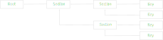

# Asset Keys
Asset key serves a couple of functions. 
Mainly, it is a reference and a provider of localization resources and language strings.
It also mediates parameters and hints from the localization consumer to the producer.
<p/>

Asset key is constructed by appending parts from root key towards tail. 
The constructed result is, however, a linked list from tail to root,
as each link has a directed reference only towards its parent.

```csharp
ILine key = new LocalizationRoot().Section("Section").Section("Section").Key("Key");
```

<p/>
Nodes can also be constructed to span a tree structure.

```csharp
ILineRoot root = new LocalizationRoot();
ILine section1 = root.Section("Section1");
ILine section2 = section1.Section("Section2");
ILine section1_1 = section1.Section("Section1.1");
ILine key1_1_1 = section1_1.Key("Key1");
ILine key1_1_2 = section1_1.Key("Key2");
// ...
```

<p/>

## Reference and Provider
Key can be used as a *reference*. 

```csharp
// Create localization reference
ILine key = new LocalizationRoot().Section("Section").Section("Section").Key("Key");

// Retrieve string with a reference
IFormulationString str = asset.GetString(key.Culture("en"));

// Retrieve binary resource with a reference
byte[] data = asset.GetResource(key.Culture("en"));
```

And, as a *provider*.
Provider key needs to have a root, which must be associated with an asset and a culture policy.
Extension methods can be used for retrieving strings and binary resources.

```csharp
// Language string source
Dictionary<string, string> src = new Dictionary<string, string> { { "en:Section:Key", "Hello World!" } };
// Create Asset
IAsset asset = new LocalizationAsset(src, KeyPrinter.Colon_Colon_Colon);
// Create culture policy
ICulturePolicy culturePolicy = new CulturePolicy();
// Create root
ILineRoot root = new LocalizationRoot(asset, culturePolicy);
// Set Current Culture
CultureInfo.CurrentCulture = new CultureInfo("en");
// Create key specific provider
ILine key = root.Section("Section").Key("Key");
// Retieve string from provider
string str = key.ToString();
// Retrieve binary resoruce from provider
byte[] data = key.GetResource();
```

## Canonical and non-canonical key parts
*Canonical* key parts are parts whose position in the linked list matters for the consumer of the localization content.
Canonical parts typically add to the identity of the key. 

```csharp
// Add canonical parts
ILine key = new LocalizationRoot().Section("Section1").Section("Section2").Key("Key");

// "Section1:Section2:Key"
string id = KeyPrinter.Colon_Colon_Colon.BuildName(key);
```

For parts that are *non-canonical* the position doesn't matter.
Non-canonical parts are typically hints, such as **.SetCulture(*string*)**.

```csharp
// Add canonical parts, and non-canonical culture
ILine key1 = new LocalizationRoot().Section("Section").Key("Key").Culture("en");
ILine key2 = new LocalizationRoot().Culture("en").Section("Section").Key("Key");

// "en:Section1:Section2:Key"
string id1 = KeyPrinter.Colon_Colon_Colon.BuildName(key1);
// "en:Section1:Section2:Key"
string id2 = KeyPrinter.Colon_Colon_Colon.BuildName(key2);
```

## Key Parts
| Parameter | Canonical | Interface | Extension Method | Description |
|:---------|:-------|:--------|:---------|:---------|
| Root | canonical | ILineRoot |  | Contains asset and culture policy. Keys are constructed from here. |
| Type | non-canonical | ILineTypeAssignable | .Type(*Type*) | Type section for grouping by classes and interfaces. |
| Location | canonical | IAsseyKeyLocationAssignable | .Location(*string*) | Hint to asset for a directory to search from. |
| Assembly | non-canonical | ILineAssemblyAssignable | .Assembly(*Assembly*) | Hint to asset for an assembly to search from. |
| Resource | canonical | ILineResourceAssignable | .Resource(*string*) | Hint to asset for an embedded resource path to search from. |
| Section | canonical | ILinesectionAssignable | .Section(*string*) | Generic section for grouping assets. |
| Key | canonical | ILineAssignable | .Key(*string*) | Leaf key |
| Culture | non-canonical | ILocalizationKeyCultureAssignable | .Culture(*CultureInfo*) | Parameter to override current culture. |
| N | non-canonical | ILocalizationKeyPluralityAssignable | .N(*Type*) | Key that specifies plurality |
|  | non-canonical | ILocalizationKeyFormatArgs | .Format(*Object[]*) | Format arguments parameter. |
|  | non-canonical | ILocalizationKeyInlines | .Inline(*string*, *string*) | Hint for default culture specific string values. |

## Type Section
Type section is a key that narrows down the scope of localization to a specific class, interface or structure.

```csharp
// Assign key to localization of type "MyController"
ILine key = new LocalizationRoot().Type(typeof(MyController));
// Search "MyController:Success"
string str = key.Key("Success").ToString();
```

There is another way with the generic method **.Type&lt;T&gt;()**. 

```csharp
// Assign key to localization of type "MyController"
ILine<MyController> key = new LocalizationRoot().Type<MyController>();
```

## Culture Key
Key can be forced to ignore culture policy, possibly due to lack of policy assignment, and to use an explicit culture info.

```csharp
// Create root that matches only to english strings
ILine root_en = new LocalizationRoot().Culture("en");
// Create key
ILine key = root_en.Section("Section").Key("Key");
```

## Formatting Args
Formattable language strings are written in format of "**{#}**", where # is replaced with argument index ([Format Syntax](https://docs.microsoft.com/en-us/dotnet/standard/base-types/composite-formatting#format-item-syntax)).

Let's have an example file *localization.ini*.
```None
[Culture:en]
Type:ConsoleApp1.MyController:Key:Success      = Success
Type:ConsoleApp1.MyController:Key:Error        = Error (Code=0x{0:X8})
```

The key assigned with a format argument by **.Format(*Object[]* args)** call.

```csharp
// Create key "Error"
ILine key = root.Type("ConsoleApp1.MyController").Key("Error");
// Formulate key
ILine key_formulated = key.Format(0xFeedF00d);
```

The parametrized key can be resolved to formatted string with **.ToString()** or **.ResolveFormulatedString()**.

```csharp
// Resolve to formulated string to "Error (Code=0xFEEDF00D)"
string str = key_formulated.ResolveFormulatedString();
```

But, if needed an unformulated string can be resolved with **.ResolveString()**.

```csharp
// Resolve to localized string "Error (Code=0x{0:X8})", but does not append arguments
string str = key_formulated.ResolveString();
```

## Inlining
Code can be [automatically scanned](http://lexical.fi/sdk/Localization/docs/InlineScanner/index.html) for inlined strings and exported to localization files.
They can be used as templates for further translation process. 
This way the templates don't need to be manually updated as the code evolves.

Default language strings can be written right into the code with 
<b>.Inline(<i>string</i>)</b> which sets string for the root culture "".

```csharp
// Create root
ILineRoot root = new LocalizationRoot();
// Create key and add default value
ILine key = root.Section("Section").Key("Success").Inline("Success");
// Resolve string from inlined key "Success"
string str = key.ToString();
```

Inlining can be provided for specific cultures with <b>.Inline(<i>string</i>, <i>string</i>)</b>.

```csharp
// Create key and add default strings
ILine key = root.Section("Section").Key("Success")
    .Inline("Success")                                 // Add inlining to the root culture ""
    .Inline("Culture:en", "Success")                   // Add inlining to culture "en"
    .Inline("Culture:fi", "Onnistui")                  // Add inlining to culture "fi"
    .Inline("Culture:sv", "Det funkar");               // Add inlining to culture "sv"
// Resolve string from inlined key "Success"
string str = key.Culture("en").ToString();
```

There are shorter extension methods for every language in namespace **Lexical.Localization.Inlines**. 

```csharp
// Create key and add default strings
ILine key = root.Section("Section").Key("Success")
    .Inline("Success")                                 // Add inlining to the root culture ""
    .en("Success")                                     // Add inlining to culture "en"
    .fi("Onnistui")                                    // Add inlining to culture "fi"
    .sv("Det funkar");                                 // Add inlining to culture "sv"
```

Caveat however, that inlining to specific cultures with <b>.Inline(<i>string</i>, <i>string</i>)</b> allocates a dictionary internally, so it might be good idea to put the key into a static reference.

```csharp
class MyController__
{
    static ILine localization = LocalizationRoot.Global.Type<MyControllerB>();
    static ILine Success = localization.Key("Success").Inline("Success").sv("Det funkar").fi("Onnistui");

    public string Do()
    {
        return Success.ToString();
    }
}
```

## Dynamic use
Asset keys from LocalizationRoot and StringLocalizationRoot are dynamically usable.

```csharp
// Dynamic assignment
dynamic root = new LocalizationRoot();
// Provides to string on typecast
string str = root.Section("Section").Key("Hello");
```

## Use in classes
If class is designed to support dependency injection without string localizers, the constructors should 
take in argument *ILine&lt;T&gt;* and possibly *ILineRoot*. See more in [Best Practices](../BestPractices/).
Constructor argument **ILine&lt;T&gt;** helps the Dependency Injection to assign the localization so that it is scoped in to correct typesection.

```csharp
class MyController
{
    ILine localization;

    public MyController(ILine<MyController> localization)
    {
        this.localization = localization;
    }

    public MyController(ILineRoot localizationRoot)
    {
        this.localization = localizationRoot.Type<MyController>();
    }

    public void Do()
    {
        string str = localization.Key("Success").en("Success").fi("Onnistui").ToString();
    }
}
```

If class is designed to use static instance and without dependency injection, localization reference can be acquired from **LocalizationRoot**.

```csharp
class MyControllerB
{
    static ILine localization = LocalizationRoot.Global.Type<MyControllerB>();

    public void Do()
    {
        string str = localization.Key("Success").en("Success").fi("Onnistui").ToString();
    }
}
```
