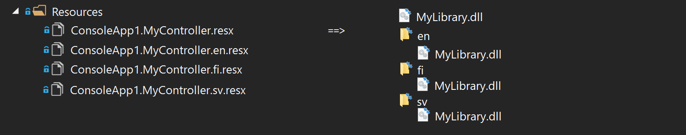

# Introduction
Part builder is a tool that helps constructing parts. 
It provides a uniform way to configurate and instantiate part classes.
[!code-csharp[Snippet](Examples.cs#Snippet_11)]

An alternative way is to construct part builder as "one-liner" to IAssetLoader.
**.NewPart()** starts a new part builder and **.End()** closes it.
[!code-csharp[Snippet](Examples.cs#Snippet_12)]

# Source Type
Part builder configuration starts by choosing sources to load assets from. There are three ways.

**1.** Assets can be loaded from local files. The root directories are added with **.Path(*string*)**. 
Path can be added multiple times, this creates a new part for each.
[!code-csharp[Snippet](Examples.cs#Snippet_1)]

**2.** Embedded resources can be loaded with **.Assembly(*Assembly*)**.
[!code-csharp[Snippet](Examples.cs#Snippet_2)]

**3.** Files can be loaded with abstraction of [IFileProvider](https://github.com/aspnet/Extensions/blob/master/src/FileProviders/Abstractions/src/IFileProvider.cs).
File provider source is added with **.FileProvider(*IFileProvider*)**. 
Note that, this extension method is available by importing namespace Lexical.Localization.Ms.Extensions and **Lexical.Localization.Ms.Extensions**.
The caller's assembly must also import nuget library [Microsoft.Extensions.FileProviders.Abstractions](https://www.nuget.org/packages/Microsoft.Extensions.FileProviders.Abstractions/).
[!code-csharp[Snippet](Examples.cs#Snippet_3)]

# File Pattern
Asset loader reads files based on parameters of the requesting key. 
File pattern is a way to describe filename(s) by adding "{parameters}" into the file name string.
[!code-csharp[Snippet](Examples.cs#Snippet_4a1)]

These parameters are later on provided by the caller in the request keys.
[!code-csharp[Snippet](Examples.cs#Snippet_4a2)]

## Parameters
Parameters are written in format of "{prefix **parametername** suffix}". 
Some of the parameters are well-known, and they also have a respective method that parametrizes a key.

Table of well-known parameter names

| Parameter | Key Method  | Description |
|----------|:--------|:------------|
| assembly | .AssemblySection(*string*) | Assembly name |
| location | .Location(*string*) | Subdirectory in local files |
| resource | .Resource(*string*) | Subdirectory in embedded resources |
| type | .TypeSection(*string*) | Class name |
| section | .Section(*string*) | Generic section, used for grouping |
| anysection | *all above* | Matches to any section above. |
| culture  | .SetCulture(*string*) | Culture |
| key | .Key(*string*) | Key name |

## Optional Parameter
Parameter is optional when it is written inside braces "{parameter/}".
[!code-csharp[Snippet](Examples.cs#Snippet_4b1)]

With optional parameter, whether parameter is provided or not, it affects the filename that is attempted to be loaded. 
**.Location(*string*)** adds "location" parameter into the key, which affects the requested filename.
[!code-csharp[Snippet](Examples.cs#Snippet_4b2)]

## Required Parameter
Parameter written inside brackets makes it a required parameter "[parameter/]". 
[!code-csharp[Snippet](Examples.cs#Snippet_4c1)]

Key is added with "location" parameter with the call **.Location(*string*)**.
[!code-csharp[Snippet](Examples.cs#Snippet_4c2)]

## Recurring Parameters
Parameter can be added multiple times by adding suffix "_#", replace # with the occurance index. "_n" represents the last occurance.
[!code-csharp[Snippet](Examples.cs#Snippet_4d1)]
To this asset **.Location(*string*)** can be inserted 0-3 times.
[!code-csharp[Snippet](Examples.cs#Snippet_4d2)]

## Match Parameters
To make a part to search for existing files, add **.MatchParameter(*string*)**. 
This will make the part to try to match missing parameters against detected file names.
[!code-csharp[Snippet](Examples.cs#Snippet_4e)]

## Regular Expressions
Regular expression can be written inside angle brackets "{parameter&lt;*regexp*&gt;/}".
This will give more control on how the pattern is matched when using with **.MatchParameter(*string*)**.
[!code-csharp[Snippet](Examples.cs#Snippet_4f)]

# Embedded Resource
Source type for embedded resources is set with **.Assembly(*Assembly*)**, and then 
resources selected with **.EmbeddedResource(*string*)** .
[!code-csharp[Snippet](Examples.cs#Snippet_5a1)]
Key doesn't need "assembly" parameter if the assembly's namespace was hardcoded into the embedded pattern.
[!code-csharp[Snippet](Examples.cs#Snippet_5a2)]

<br/>
Mandatory parameter is written inside brackets.
[!code-csharp[Snippet](Examples.cs#Snippet_5b1)]
Required parameter "[assembly]" must be provided with the key by calling **.AssemblySection(*string*)**.
[!code-csharp[Snippet](Examples.cs#Snippet_5b2)]

<br/>
Parameter "resource" is used for describing a resource path within embedded resources. **.ResourceSection()** adds that path to a key.

If parameter is configured to match with **.MatchParameters()**, then providing parameters is optional. 
[!code-csharp[Snippet](Examples.cs#Snippet_5c1)]
Parameters "assembly" and "resource" are not provided and are matched to existing resource names.
[!code-csharp[Snippet](Examples.cs#Snippet_5c2)]

# Binary Resources
To configure the part to retrieve binary resources
add **.Resource()** to signal the builder to make it build part(s) that implement **IAssetResourceProvider**.
Resource parts provide binary files, such as icons, graphics, audio.
[!code-csharp[Snippet](Examples.cs#Snippet_10)]

# Language Strings
To read language strings from text based files, a key name policy must be added.

For example, let's assume there is **localization.ini** file with the following language strings.
```none
[en]
controller:hello = Hello World!

[de]
controller:hello = Hallo Welt!
```

Key policy is a description of how to convert IAssetKey into a localization file key.
There are three ways to add a key policy.

**1.** Assign policy with **.KeyPolicy(default)**.
Default policy finds one that is default for the given file extension type. 
For example, the default policy for .ini is to append culture and then then other parts canonically with ":" as separator.
[!code-csharp[Snippet](Examples.cs#Snippet_6)]

**2.** Assign key policy with **.KeyPolicy(*IAssetKeyNameProvider*)** or **.KeyPolicy(*IAssetKeyNamePolicy*)**.
See [AssetKeyNameProvider](https://github.com/tagcode/Lexical.Localization/blob/master/Lexical.Localization/Localization/AssetKey/AssetKeyNameProvider.cs) for a few default implementations.
[!code-csharp[Snippet](Examples.cs#Snippet_7)]

**3.** Assign key as name pattern **.KeyPattern(*string*)**.
[!code-csharp[Snippet](Examples.cs#Snippet_8)]


Finally the part builder is concluded with **.Strings()** to make it implement **ILocalizationStringProvider**.

## File Formats
File formats .ini, .json, .xml, .resx, and .resources are supported by default.
Other formats can implemented by two ways:

<br/>
**1.** Implement ILocalizationFileReader and add its constructor to Lexical.Localization.LocalizationTextReaderBuilder.BinaryReaderConstructors.

<br/>
**2.** Implement delegate Lexical.Localization.AssetFileConstructor that constructs an IAsset, and then provide that delegate to part builder with **.AssetFileConstructor(*delegate*)**
[!code-csharp[Snippet](Examples.cs#Snippet_13)]

# ResourceManager
Although .resx and .resources fileformats can be read as string files, an alternative way is to construct asset so
that it uses ResourceManagerAsset which forwards calls to System.Resources.ResourceManager instance.
ResourceManagerAsset can read both strings and resources. 

Constructe with **.ResourceManager()**. 
[!code-csharp[Snippet](Examples.cs#Snippet_9)]

Note that, MSBuild spreads embedded .resx files into satellite assemblies under culture specific folders.


Note two, resource managers cannot be read from IFileProviders sources.

# Links
* [Example code](https://github.com/tagcode/Lexical.Localization/tree/master/docs/IAssetLoader/PartBuilder/Examples.cs)
* [Lexical.Localization.Abstractions](https://github.com/tagcode/Lexical.Localization/tree/master/Lexical.Localization.Abstractions) ([NuGet](https://www.nuget.org/packages/Lexical.Localization.Abstractions/))
 * [IAssetLoaderPart](https://github.com/tagcode/Lexical.Localization/blob/master/Lexical.Localization/Abstractions/Asset/IAssetLoaderPart.cs)
 * [IAssetLoaderPartOptions](https://github.com/tagcode/Lexical.Localization/blob/master/Lexical.Localization/Abstractions/Asset/IAssetLoaderPartOptions.cs)
* [Lexical.Localization](https://github.com/tagcode/Lexical.Localization/tree/master/Lexical.Localization) ([NuGet](https://www.nuget.org/packages/Lexical.Localization/))
 * [AssetLoaderPartBuilder](https://github.com/tagcode/Lexical.Localization/blob/master/Lexical.Localization/Localization/AssetLoader/AssetLoaderPartBuilder.cs)
* [Lexical.Localization.Abstractions](https://github.com/tagcode/Lexical.Localization/tree/master/Lexical.Localization.Abstractions) ([NuGet](https://www.nuget.org/packages/Lexical.Localization.Abstractions/))
 * [AssetLoaderPartBuilder](https://github.com/tagcode/Lexical.Localization/blob/master/Lexical.Localization/Localization/LocalizationAssetLoader/AssetLoaderPartBuilder.cs)
