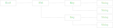

# Line
**ILine** is an object that can carry hints, key reference and strings.

It can be implemented with one class, but it is typically composed of line parts that form
a linked list.
[!code-csharp[Snippet](Examples.cs#Snippet_1)]

<br/>

Or constructed to span a tree structure (trie).
[!code-csharp[Snippet](Examples.cs#Snippet_2)]

<br/>

# Asset Keys
Asset key serves a couple of functions. 
Mainly, it is a reference and a provider of localization resources and language strings.
It also mediates parameters and hints from the localization consumer to the producer.
<p/>

Asset key is constructed by appending parts from root key towards tail. 
The constructed result is, however, a linked list from tail to root,
as each link has a directed reference only towards its parent.
[!code-csharp[Snippet](Examples.cs#Snippet_1)]

<p/>
Nodes can also be constructed to span a tree structure.
[!code-csharp[Snippet](Examples.cs#Snippet_2)]

<p/>

## Reference and Provider
Key can be used as a *reference*. 
[!code-csharp[Snippet](Examples.cs#Snippet_3a)]

And, as a *provider*.
Provider key needs to have a root, which must be associated with an asset and a culture policy.
Extension methods can be used for retrieving strings and binary resources.
[!code-csharp[Snippet](Examples.cs#Snippet_3b)]

## Canonical and non-canonical key parts
*Canonical* key parts are parts whose position in the linked list matters for the consumer of the localization content.
Canonical parts typically add to the identity of the key. 
[!code-csharp[Snippet](Examples.cs#Snippet_4a)]

For parts that are *non-canonical* the position doesn't matter.
Non-canonical parts are typically hints, such as **.SetCulture(*string*)**.
[!code-csharp[Snippet](Examples.cs#Snippet_4b)]

## Key Parts
| Parameter | Canonical | Interface | Extension Method | Description |
|:---------|:-------|:--------|:---------|:---------|
| Root | canonical | ILineRoot |  | Contains asset and culture policy. Keys are constructed from here. |
| Type | non-canonical | ILineTypeAssignable | .Type(*Type*) | Type section for grouping by classes and interfaces. |
| Location | canonical | IAsseyKeyLocationAssignable | .Location(*string*) | Hint to asset for a directory to search from. |
| Assembly | non-canonical | ILineAssemblyAssignable | .Assembly(*Assembly*) | Hint to asset for an assembly to search from. |
| Resource | canonical | ILineResourceAssignable | .Resource(*string*) | Hint to asset for an embedded resource path to search from. |
| Section | canonical | ILinesectionAssignable | .Section(*string*) | Generic section for grouping assets. |
| Key | canonical | ILineAssignable | .Key(*string*) | Leaf key |
| Culture | non-canonical | ILineCultureAssignable | .Culture(*CultureInfo*) | Parameter to override current culture. |
| N | non-canonical | ILinePluralityAssignable | .N(*Type*) | Key that specifies plurality |
|  | non-canonical | ILineFormatArgs | .Format(*Object[]*) | Format arguments parameter. |
|  | non-canonical | ILineInlines | .Inline(*string*, *string*) | Hint for default culture specific string values. |

## Type Section
Type section is a key that narrows down the scope of localization to a specific class, interface or structure.
[!code-csharp[Snippet](Examples.cs#Snippet_8a)]

There is another way with the generic method **.Type&lt;T&gt;()**. 
[!code-csharp[Snippet](Examples.cs#Snippet_8b)]

## Culture Key
Key can be forced to ignore culture policy, possibly due to lack of policy assignment, and to use an explicit culture info.
[!code-csharp[Snippet](Examples.cs#Snippet_9a)]

## Formatting Args
Formattable language strings are written in format of "**{#}**", where # is replaced with argument index ([Format Syntax](https://docs.microsoft.com/en-us/dotnet/standard/base-types/composite-formatting#format-item-syntax)).

Let's have an example file *localization.ini*.
```None
[Culture:en]
Type:ConsoleApp1.MyController:Key:Success      = Success
Type:ConsoleApp1.MyController:Key:Error        = Error (Code=0x{0:X8})
```

The key assigned with a format argument by **.Format(*Object[]* args)** call.
[!code-csharp[Snippet](Examples.cs#Snippet_6b)]

The parametrized key can be resolved to formatted string with **.ToString()** or **.ResolveFormulatedString()**.
[!code-csharp[Snippet](Examples.cs#Snippet_6d)]

But, if needed an unformulated string can be resolved with **.ResolveString()**.
[!code-csharp[Snippet](Examples.cs#Snippet_6c)]

## Inlining
Code can be [automatically scanned](http://lexical.fi/sdk/Localization/docs/InlineScanner/index.html) for inlined strings and exported to localization files.
They can be used as templates for further translation process. 
This way the templates don't need to be manually updated as the code evolves.

Default language strings can be written right into the code with 
<b>.Inline(<i>string</i>)</b> which sets string for the root culture "".
[!code-csharp[Snippet](Examples.cs#Snippet_7a)]

Inlining can be provided for specific cultures with <b>.Inline(<i>string</i>, <i>string</i>)</b>.
[!code-csharp[Snippet](Examples.cs#Snippet_7b)]

There are shorter extension methods for every language in namespace **Lexical.Localization.Inlines**. 
[!code-csharp[Snippet](Examples.cs#Snippet_7c)]

Caveat however, that inlining to specific cultures with <b>.Inline(<i>string</i>, <i>string</i>)</b> allocates a dictionary internally, so it might be good idea to put the key into a static reference.
[!code-csharp[Snippet](Examples.cs#Snippet_7d)]

## Dynamic use
Asset keys from LineRoot and StringLineRoot are dynamically usable.
[!code-csharp[Snippet](Examples.cs#Snippet_10)]

## Use in classes
If class is designed to support dependency injection without string localizers, the constructors should 
take in argument *ILine&lt;T&gt;* and possibly *ILineRoot*. See more in [Best Practices](../BestPractices/).
Constructor argument **ILine&lt;T&gt;** helps the Dependency Injection to assign the localization so that it is scoped in to correct typesection.
[!code-csharp[Snippet](Examples.cs#Snippet_11a)]

If class is designed to use static instance and without dependency injection, localization reference can be acquired from **LineRoot**.
[!code-csharp[Snippet](Examples.cs#Snippet_11b)]
