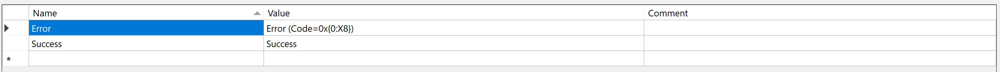

# File Formats
Four fileformats can be used out of the box, provided that the files follow a suitable structure.
Localization files can be organized in many ways, internally and between each other. 
[Key name policy](../IAssetKeyNamePolicy/) is used for describing file names and lines.

Files can be loaded with a couple of ways.
1. Using a reader to construct [an asset](#loading-asset).
2. With asset loader and [part builder](../IAssetLoader/PartBuilder/index.md).
3. With asset loader and [part class](../IAssetLoader/PartClasses/index.md#file-strings).

Example of **.xml** localization file.
```
<?xml version="1.0" encoding="UTF-8"?>
<configuration>
  <ConsoleApp1.MyController>
    <Success>Success</Success>
    <Error>Error (Code=0x{0:X8})</Error>
  </ConsoleApp1.MyController>
  <en>
    <ConsoleApp1.MyController>
        <Success>Success</Success>
        <Error>Error (Code=0x{0:X8})</Error>
    </ConsoleApp1.MyController>
  </en>
  <fi>
    <ConsoleApp1.MyController>
      <Success>Onnistui</Success>
        <Error>Virhe (Koodi=0x{0:X8})</Error>
    </ConsoleApp1.MyController>
  </fi>
</configuration>
```

Example of **.ini** localization file.
```none
ConsoleApp1.MyController:Success      = Success
ConsoleApp1.MyController:Error        = Error (Code=0x{0:X8})

[en]
ConsoleApp1.MyController:Success      = Success
ConsoleApp1.MyController:Error        = Error (Code=0x{0:X8})

[fi]
ConsoleApp1.MyController:Success      = Onnistui
ConsoleApp1.MyController:Error        = Virhe (Koodi=0x{0:X8})
```

Example of **.json** localization file.
```
{
  "ConsoleApp1.MyController": {
      "Success": "Success",
      "Error": "Error (Code=0x{0:X8})"
  },
  "en": {
    "ConsoleApp1.MyController": {
      "Success": "Success",
      "Error": "Error (Code=0x{0:X8})"
    }
  },
  "fi": {
    "ConsoleApp1.MyController": {
      "Success": "Onnistui",
      "Error": "Virhe (Koodi=0x{0:X8})"
    }
  }
}
```

Example of **.resx** localization file.


# Loading Asset
Files can then be loaded with a constructor.
[!code-csharp[Snippet](Examples.cs#Snippet_1)]

# Implementing
<details>
  <summary><b>ILocalizationFileReader</b> is interface for classes that tokenize text file formats, and any hierarchical formats. (<u>Click here</u>)</summary>
[!code-csharp[Snippet](../../Lexical.Localization//LocalizationFile/ILocalizationFileFormat.cs#ILocalizationFileReader)]
</details>

<p/>
And then adding to constructor delegate to **LocalizationTextReaderBuilder**.
[!code-csharp[Snippet](Examples.cs#Snippet_2)]

Non-hierarchical formats can be implemented by implementing IAsset that reads the format.	

# Links
* [Lexical.Localization](https://github.com/tagcode/Lexical.Localization/tree/master/Lexical.Localization) ([NuGet](https://www.nuget.org/packages/Lexical.Localization/))
 * [ILocalizationFileReadable](https://github.com/tagcode/Lexical.Localization/blob/master/Lexical.Localization/LocalizationFile/ILocalizationFileReadable.cs)
 * [ILocalizationFileWritable](https://github.com/tagcode/Lexical.Localization/blob/master/Lexical.Localization/LocalizationFile/ILocalizationFileWritable.cs)
 * [IniFileFormat](https://github.com/tagcode/Lexical.Localization/blob/master/Lexical.Localization/LocalizationFile/IniFileFormat.cs)
 * [JsonFileFormat](https://github.com/tagcode/Lexical.Localization/blob/master/Lexical.Localization/LocalizationFile/JsonFileFormat.cs)
 * [ResourcesFileFormat](https://github.com/tagcode/Lexical.Localization/blob/master/Lexical.Localization/LocalizationFile/ResourcesFileFormat.cs)
 * [ResxFileFormat](https://github.com/tagcode/Lexical.Localization/blob/master/Lexical.Localization/LocalizationFile/ResxFileFormat.cs)
 * [XmlFileFormat](https://github.com/tagcode/Lexical.Localization/blob/master/Lexical.Localization/LocalizationFile/XmlFileFormat.cs)
