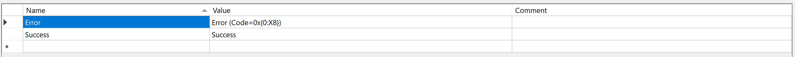

# Localization File
Four fileformats can be used out of the box, provided that the files follow a suitable structure.
Localization files can be organized in many ways, internally and between each other. 
[Key name policy](../IAssetKeyNamePolicy/) is used for describing file names and lines.

Files can be loaded with a couple of ways.
1. Using a reader to construct [an asset](#loading-asset).
2. With asset loader and [part builder](../IAssetLoader/PartBuilder/index.md).
3. With asset loader and [part class](../IAssetLoader/PartClasses/index.md#file-strings).

Example of **.resx** localization file.

# Loading Asset
Files can then be loaded with a constructor.
[!code-csharp[Snippet](Examples.cs#Snippet_1a)]

[!code-csharp[Snippet](Examples.cs#Snippet_1b)]

# Implementing

  
<b>ILocalizationFileFormat</b> is interface for classes that tokenize text file formats, and any hierarchical formats. (<u>Click here</u>)

[!code-csharp[Snippet](../../Lexical.Localization.Abstractions/LocalizationFile/ILocalizationFileFormat.cs#ILocalizationFileReader)]

And then adding to constructor delegate to **LocalizationReaderMap.Instance**.
[!code-csharp[Snippet](Examples.cs#Snippet_2)]

Non-hierarchical formats can be implemented by implementing IAsset that reads the format.	

  
Example implementation ExtFileFormat. (<u>Click here</u>)

[!code-csharp[Snippet](Examples.cs#Snippet_3)]

# Links
* [Lexical.Localization](https://github.com/tagcode/Lexical.Localization/tree/master/Lexical.Localization) ([NuGet](https://www.nuget.org/packages/Lexical.Localization/))
 * [ILocalizationFileReadable](https://github.com/tagcode/Lexical.Localization/blob/master/Lexical.Localization/LocalizationFile/ILocalizationFileReadable.cs)
 * [ILocalizationFileWritable](https://github.com/tagcode/Lexical.Localization/blob/master/Lexical.Localization/LocalizationFile/ILocalizationFileWritable.cs)
 * [IniLocalizationReader](https://github.com/tagcode/Lexical.Localization/blob/master/Lexical.Localization/LocalizationFile/IniLocalizationReader.cs)
 * [JsonLocalizationReader](https://github.com/tagcode/Lexical.Localization/blob/master/Lexical.Localization/LocalizationFile/JsonLocalizationReader.cs)
 * [ResourcesLocalizationReader](https://github.com/tagcode/Lexical.Localization/blob/master/Lexical.Localization/LocalizationFile/ResourcesLocalizationReader.cs)
 * [ResXLocalizationReader](https://github.com/tagcode/Lexical.Localization/blob/master/Lexical.Localization/LocalizationFile/ResXLocalizationReader.cs)
 * [XmlLocalizationReader](https://github.com/tagcode/Lexical.Localization/blob/master/Lexical.Localization/LocalizationFile/XmlLocalizationReader.cs)
