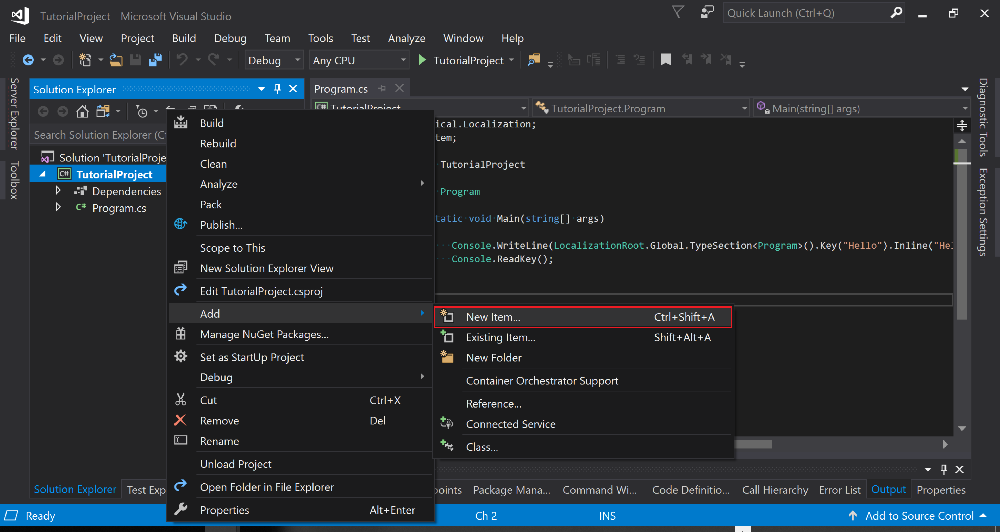
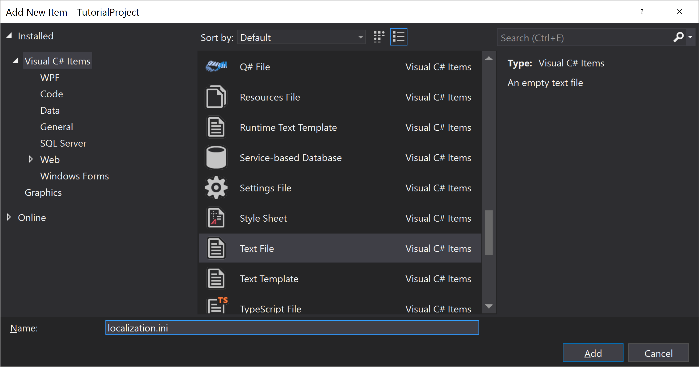
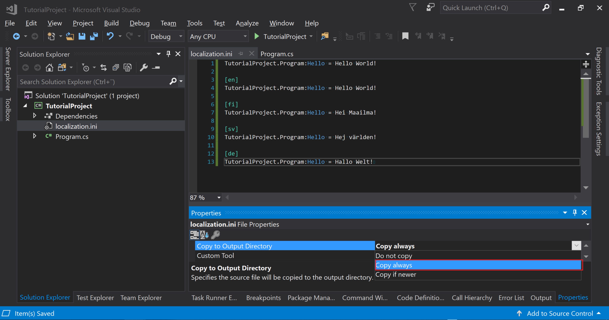

## Localization Asset
This tutorial shows how to load language strings from an external file.
<br/>

Add new text file **"HelloWorld.ini"** into the C# project.





<br/>
Paste the following text to the **HelloWorld.ini**, and then save the document.


```ini
Type:TutorialProject.Program:Key:Hello = Hello World!

[Culture:en]
Type:TutorialProject.Program:Key:Hello = Hello World!

[Culture:fi]
Type:TutorialProject.Program:Key:Hello = Hei Maailma!

[Culture:sv]
Type:TutorialProject.Program:Key:Hello = Hej världen!

[Culture:de]
Type:TutorialProject.Program:Key:Hello = Hallo Welt!

```

<br/>
Go to properties of **HelloWorld.ini** and change **Copy to Output Directory** to **Copy always**. Now the file will be copied to the .exe folder.



<br/>
Next, open the **Program.cs** and modify the code to the following.


```csharp
using Lexical.Localization;
using System;
using System.Globalization;

namespace TutorialProject
{
    public class Program
    {
        public static void Main(string[] args)
        {
            // Create a loader
            IAsset asset = IniLocalizationReader.Instance.CreateFileAsset("HelloWorld.ini");

            // Add asset to global singleton instance
            LocalizationRoot.Builder.AddAsset(asset);
            LocalizationRoot.Builder.Build();

            // Take reference of the root
            IAssetRoot root = LocalizationRoot.Global;

            // Create key
            IAssetKey key = root.Type<Program>().Key("Hello").Inline("Hello World!");

            // Print with current culture
            Console.WriteLine(key);

            // Print with other cultures
            CultureInfo.CurrentCulture = CultureInfo.GetCultureInfo("de");
            Console.WriteLine(key);

            CultureInfo.CurrentCulture = CultureInfo.GetCultureInfo("fi");
            Console.WriteLine(key);

            CultureInfo.CurrentCulture = CultureInfo.GetCultureInfo("sv");
            Console.WriteLine(key);

            Console.ReadKey();
        }
    }
}

```

Now run the program.


