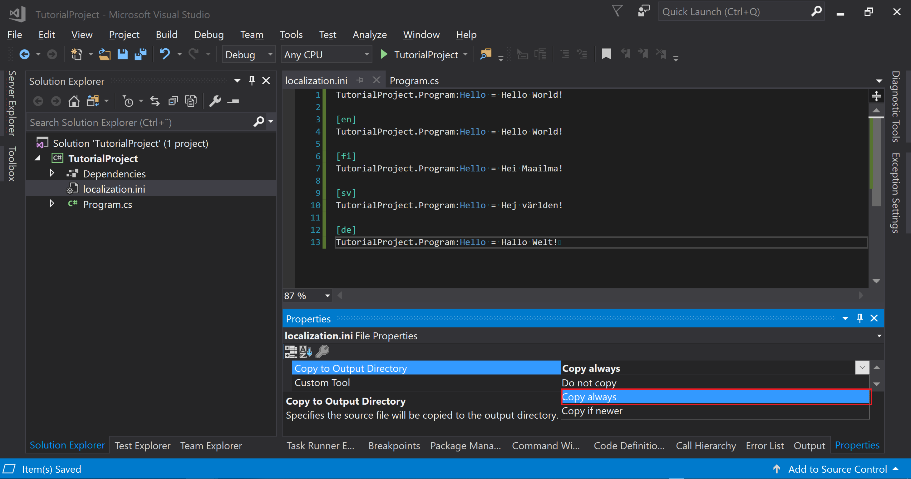
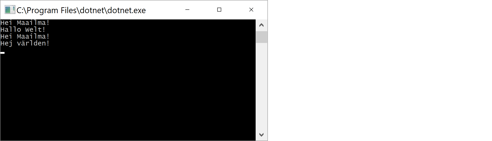

## Localization Asset
This tutorial shows how to load language strings from an external file.
<br/>

Add new text file **"localization.ini"** into the C# project.


<br/>
Paste the following text to the **localization.ini**, and then save the document.

```
TutorialProject.Program:Hello = Hello World!

[en]
TutorialProject.Program:Hello = Hello World!

[fi]
TutorialProject.Program:Hello = Hei Maailma!

[sv]
TutorialProject.Program:Hello = Hej världen!

[de]
TutorialProject.Program:Hello = Hallo Welt!
```

<br/>
Go to properties of **localization.ini** and change **Copy to Output Directory** to **Copy always**. Now the file will be copied to the .exe folder.



<br/>
Next, open the **Program.cs** and modify the code to the following.

```C#
using Lexical.Asset;
using Lexical.Localization;
using System;
using System.Globalization;

namespace TutorialProject
{
    class Program
    {
        static void Main(string[] args)
        {
            // Create a loader
            IAsset asset = new AssetLoader()
                .AddFileStrings(new string[] { "." }, "localization.ini");

            // Add asset to global singleton instance
            LocalizationRoot.Builder.AddSource(asset);
            LocalizationRoot.Builder.Build();

            // Take reference of the root
            IAssetRoot root = LocalizationRoot.Global;

            // Create key
            IAssetKey key = root.TypeSection<Program>().Key("Hello").Inline("Hello World!");

            // Print with current culture
            Console.WriteLine(key);

            // Print with other cultures
            CultureInfo.CurrentCulture = CultureInfo.GetCultureInfo("de");
            Console.WriteLine(key);

            CultureInfo.CurrentCulture = CultureInfo.GetCultureInfo("fi");
            Console.WriteLine(key);

            CultureInfo.CurrentCulture = CultureInfo.GetCultureInfo("sv");
            Console.WriteLine(key);

            Console.ReadKey();
        }
    }
}
```

Now run the program.


