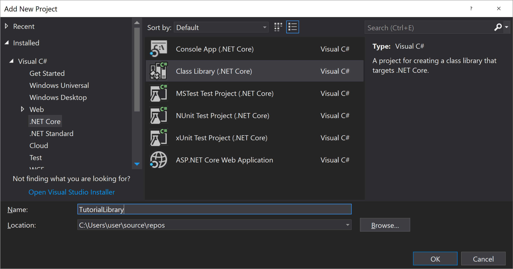

# Writing Class Library
This tutorial shows how to use localization in class libraries.

Create new .NET Standard class library **TutorialLibrary**.

There are three ways to add localization to class library.

## Method A: Static Instance
Static instance **LineRoot.Global** can be used in class libraries for localization
when the class library doesn't need to support Inversion of Control (IoC) and Dependency Injection (DI).

Features:
* Allows inlining strings in the code
* Inlined strings can be scanned from the code
* Dependency to NuGet **Lexical.Localization**
* Application must setup static asset with initialized strings.
* Not for Inversion of Control

First, Add NuGet reference to **Lexical.Localization**.

Then, write this example class **MyController1.cs** that uses the static instance **LineRoot.Global**.

[!code-csharp[snippet](ExampleA1.cs)]

Localization strings can now be provided in the startup of the application by adding IAssets to the static instance.

## Method B: Lexical.Localization.Abstractions
If class library supports Inversion of Control (IoC), then **Lexical.Localization.Abstractions** can be used for localization.

Features:
* Allows inlining strings in the code
* Inlined strings can be scanned from the code
* Dependency to NuGet **Lexical.Localization.Abstractions**
* Application must setup asset that is initialized with strings.
* For Inversion of Control

First, add NuGet reference to **Lexical.Localization.Abstractions**.

Then write this example code **MyController2.cs**

[!code-csharp[snippet](ExampleB1.cs)]

In the setup of the application ILineRoot needs to be provided for the class.

[!code-csharp[snippet](ExampleB2.cs)]

## Method C: Microsoft.Extensions.Localization.Abstractions

Features:
* Doesn't allow inlining strings in the code
* Keys of strings can be scanned from the code, but not inlined values
* Dependency to NuGet **Microsoft.Extensions.Localization.Abstractions**
* Application must setup asset that is initialized with strings.
* Usable for Inversion of Control

First, add NuGet reference to **Microsoft.Extensions.Localization.Abstractions**.

Then write this example code **MyController3.cs**

[!code-csharp[snippet](ExampleC1.cs)]

In the setup of the application IStringLocalizerFactory or IStringLocalizer&lt;Type&gt; needs to be provided for the class.

[!code-csharp[snippet](ExampleC2.cs)]