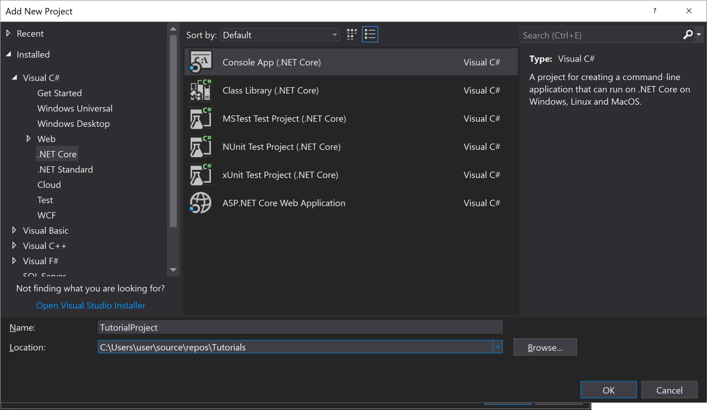
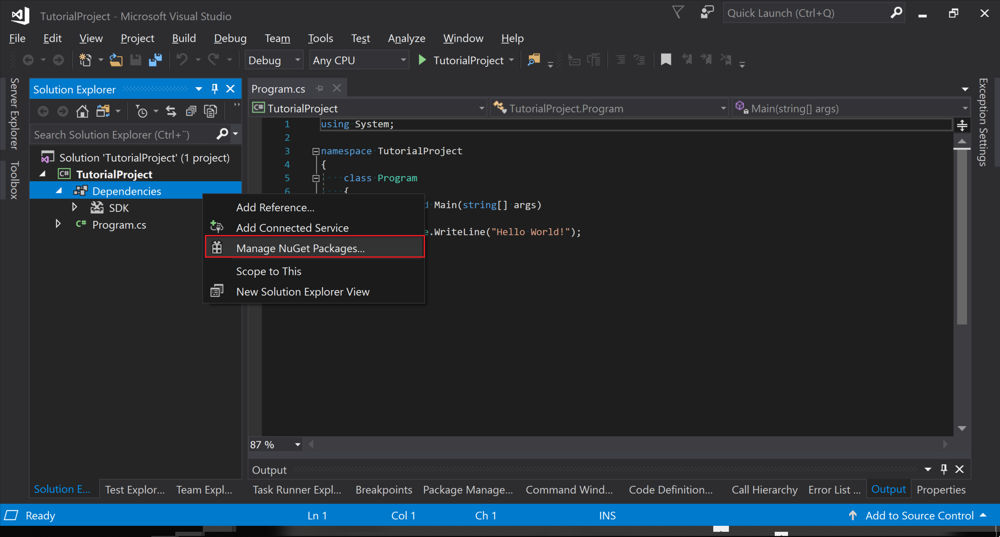
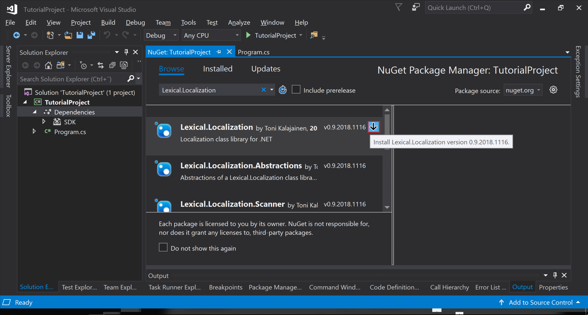
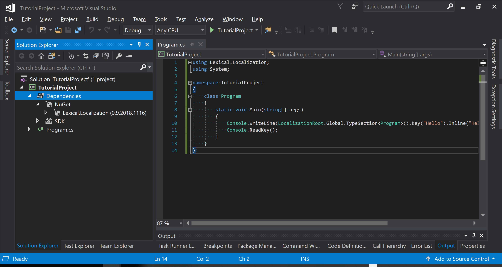

# Console Application
In this tutorial we create new Hello World console application that utilizes localization.

<br/>
First, setup a new solution and a C# project. It can be either a .NET Framework project or .NET Core.



<br/>
Then, open "Manage NuGet Packages...",



<br/>
... and search for NuGet package "Lexical.Localization" and click the download symbol. The other plugins such as "Lexical.Localization.Abstractions" don't need to be installed as they
are automatically pulled as they are dependencies. 



<br/><br/>
In the Program.cs code, replace the "Console.WriteLine("Hello World!");" with following code.

```C#
Console.WriteLine( LocalizationRoot.Global.Type<Program>().Key("Hello").Inline("Hello World!") );
Console.ReadKey();
```

This needs an import to "Lexical.Localization". If you press **Ctrl + .** in Visual Studio, it should suggest to add that *using* statement. Code so far.

```C#
using Lexical.Localization;
using System;

namespace TutorialProject
{
    class Program
    {
        static void Main(string[] args)
        {
            Console.WriteLine(LocalizationRoot.Global.Type<Program>().Key("Hello").Inline("Hello World!"));
            Console.ReadKey();
        }
    }
}
```

The singleton instance **LocalizationRoot.Global** is one of the ways get a reference to a IAssetRoot. Localization keys are built from a root instance (IAssetKey). 

The key in the exmaple is appended with two parts that contribute to key identity. 
The first part **.Type&lt;Program&gt;()** creates a type section with value *"TutorialProject.Program"* which is derived from the class name. 
Sections give hints for grouping localization strings in langauage string files.

The second part **.Key("Hello")** creates the leaf part of the key with identifier *"Hello"*. 
The combined identifier is *"TutorialProject.Program:Hello"* if name policy had colon as separator.

The last call **.Inline("Hello World!"))** adds an inlined string for root culture "".
It would be possible to add more inlines, and with specific cultues, for example **.Inline("sv", "Hej!"))**.
Note that, inlining doesn't modify the identity of the key.
It is recommended that default values are written for the "" root culture and not for "en" english culture, even if the default strings are in english language.

<br/><br/>
Run the application (F5), you should still see the "Hello world". But this time the string is localized, and can be extended with other languages.


<br/><br/>
View at end of tutorial.


